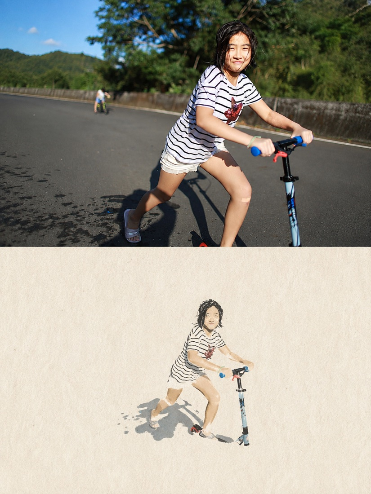
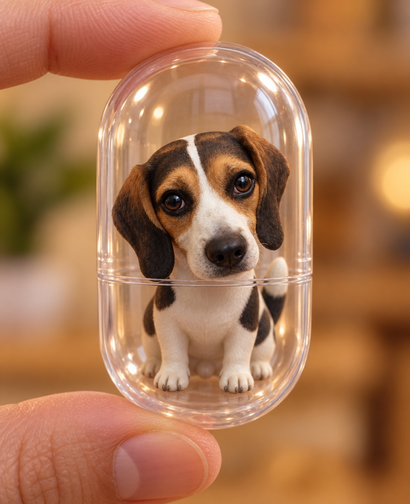
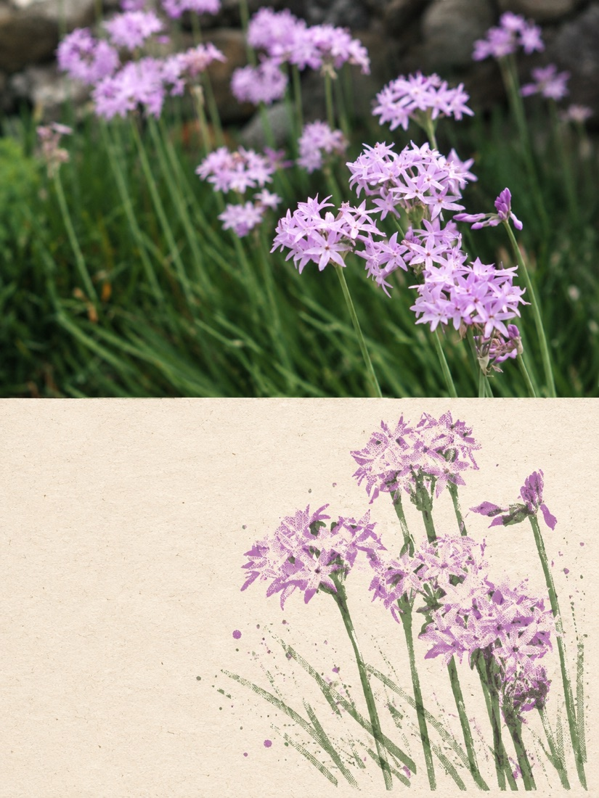
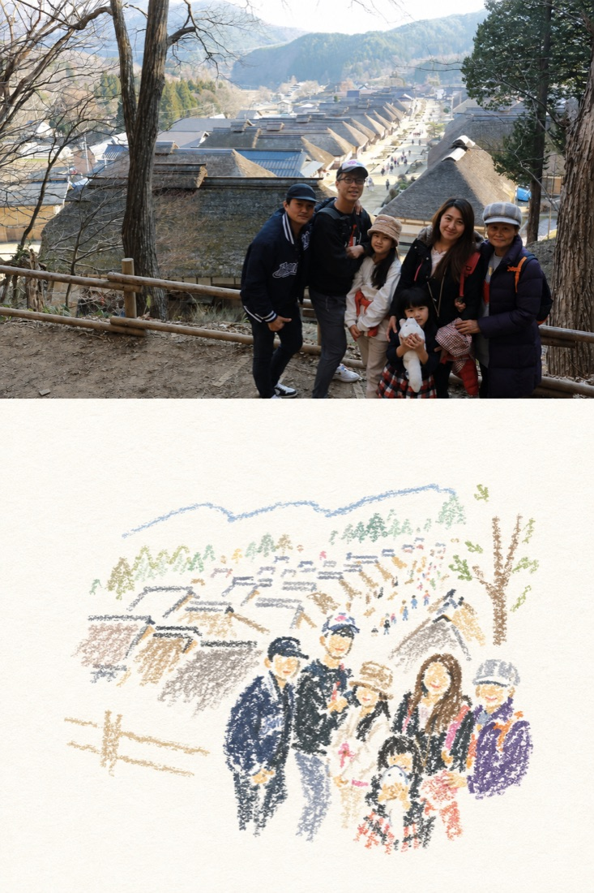
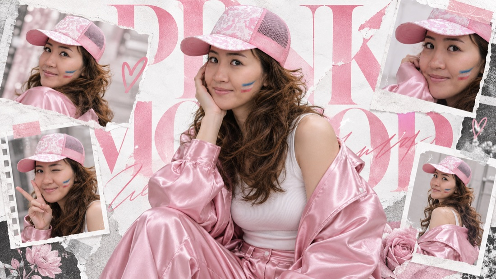
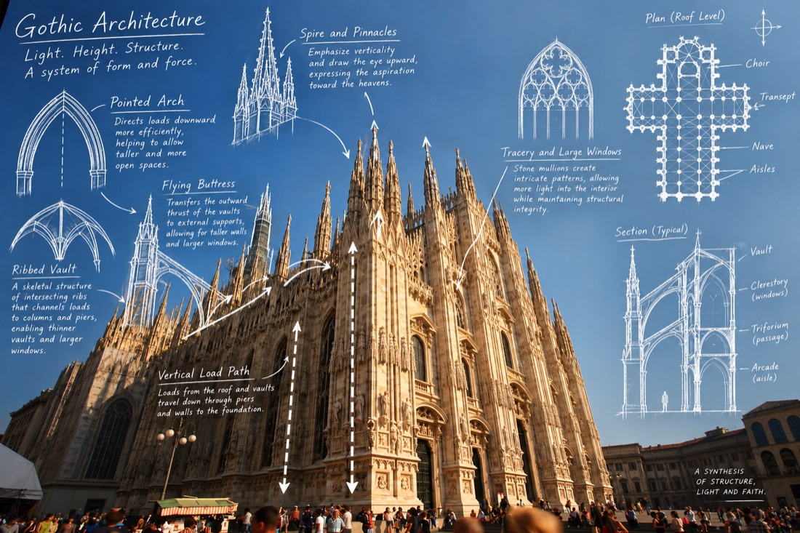
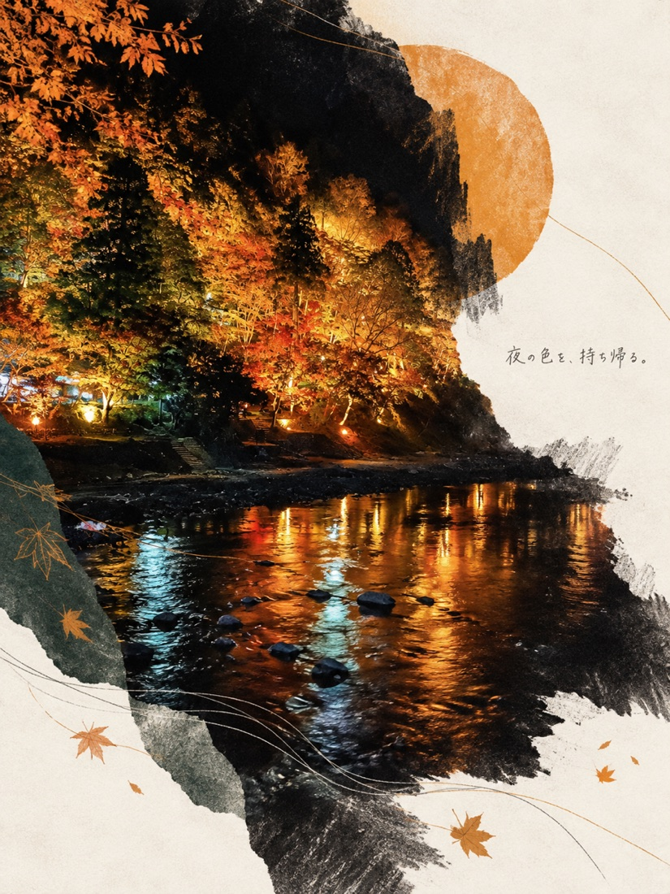

# Flickr & Google Photos Album ImageGen

A personal Codex skill that downloads an ordered range of photos from a public Flickr album, a user-provided Flickr Guest Pass, or a Google Photos shared album and transforms each photo independently with a user-provided image-generation prompt.

## Install

Clone this repository into your personal Codex skills directory:

```bash
git clone https://github.com/orafrank/flickr-album-imagegen.git ~/.codex/skills/flickr-album-imagegen
```

Restart Codex, then ask it to use `flickr-album-imagegen` with:

- a public Flickr album URL, Flickr Guest Pass URL, or Google Photos share URL;
- a page or photo range;
- an image transformation prompt.

You may also omit the long prompt and select a built-in preset: `editorial-handdrawn`, `capsule-figurine`, `riso-editorial`, `rubber-stamp-journal`, `pastel-crayon`, `korean-pink-editorial`, `landmark-blueprint`, or `japanese-editorial-memory`. Without a prompt, the default is `editorial-handdrawn`.

## Built-in style presets

Replace `<album-url>` with a public Flickr album or Google Photos share link.

| Preset | Look | Copyable example |
|---|---|---|
| `editorial-handdrawn` | 3:4 photo-over-minimal-handmade-illustration editorial poster | `Use flickr-album-imagegen with <album-url>. Process the first 10 photos with editorial-handdrawn.` |
| `capsule-figurine` | Recognizable 3D chibi collectible fully sealed in a clear pill capsule | `Use flickr-album-imagegen with <album-url>. Process photos 11–20 with capsule-figurine.` |
| `riso-editorial` | 3:4 photo and RISO stencil-print art-publication poster | `Use flickr-album-imagegen with <album-url>. Process the first 5 photos with riso-editorial.` |
| `rubber-stamp-journal` | 4:3 original photo plus handmade rubber-stamp travel journal | `Use flickr-album-imagegen with <album-url>. Process photos 21–30 with rubber-stamp-journal.` |
| `pastel-crayon` | 3:4 photo plus bright-paper chalk/crayon doodle | `Use flickr-album-imagegen with <album-url>. Process the first 10 photos with pastel-crayon.` |
| `korean-pink-editorial` | 16:9 pink Korean-idol fashion magazine collage | `Use flickr-album-imagegen with <album-url>. Process the first 3 portraits with korean-pink-editorial.` |
| `landmark-blueprint` | Real landmark photograph with architectural blueprint annotations | `Use flickr-album-imagegen with <album-url>. Process the first 5 architecture photos with landmark-blueprint.` |
| `japanese-editorial-memory` | 3:4 contemporary Japanese art-book poster with a poetic handwritten memory phrase | `Use flickr-album-imagegen with <album-url>. Process the first 10 photos with japanese-editorial-memory.` |

Extra directions can be appended to any preset, for example: `Use rubber-stamp-journal, but omit all typography and use brighter ivory paper.` A fully custom prompt is still supported.

### Style gallery

Each image below is an actual single-photo output from its named preset.

| Style | Example | Style | Example |
|---|---|---|---|
| `editorial-handdrawn`<br>Photo + minimal handmade illustration |  | `capsule-figurine`<br>Clear capsule collectible |  |
| `riso-editorial`<br>RISO editorial print |  | `rubber-stamp-journal`<br>Rubber-stamp travel journal |  |
| `pastel-crayon`<br>Pastel crayon poster |  | `korean-pink-editorial`<br>Pink Korean editorial collage |  |
| `landmark-blueprint`<br>Architectural field blueprint |  | `japanese-editorial-memory`<br>Japanese editorial memory poster |  |

### Japanese Editorial Memory Poster prompt example

> Use `flickr-album-imagegen` with `<album-url>`. Process the first 10 photos with `japanese-editorial-memory`. Create one independent poster per photo and do not invent locations or dates.


## Examples

### Google Photos shared album

Paste a public Google Photos **share link** and describe the range and visual treatment:

> Use `flickr-album-imagegen` with https://photos.app.goo.gl/j1eSpZZYzcnWEcDS8. Process photos 1–10 in album order. Turn every photo into a separate 4:3 rubber-stamp travel-journal poster: preserve the original photo on the left 58%, and use aged off-white paper, a small hand-carved stamp illustration, and minimal 2018 journal typography on the right 42%. Never combine photos.


### Flickr album

Paste a public Flickr album URL; `/page2` and `/with/{photo-id}` URLs are supported too:

> Use `flickr-album-imagegen` with https://www.flickr.com/photos/orafrank/albums/72177720311658577/. Process photos 40–49 in album order. Turn every photo into a separate 4:3 rubber-stamp travel-journal poster: preserve the original photo on the left 58%, and use aged off-white paper, a small hand-carved stamp illustration, and minimal journal typography on the right 42%. Never combine photos.


You can replace the sample art direction with any prompt you like. The skill keeps the requested album order and processes each source image independently.

## Optional publishing

Generated files stay local by default. After a batch is complete, you may choose:

- **Local only** — no external upload.
- **Flickr** — upload to a verified existing album owned by the authenticated account, with explicit public/friends/family/private and search-visibility settings.
- **Google Photos** — upload to an album created by this integration.

Every upload uses a two-step safety flow. First, the skill creates a read-only upload plan showing the provider, account, exact album name and ID, ordered filenames, and privacy/sharing state. It uploads only after you confirm that plan's unique confirmation code. Changed or missing files invalidate the plan.

Google Photos API note: since March 31, 2025, API uploads can be added only to albums created by the same integration. Arbitrary existing or shared albums cannot be selected, and album sharing must be managed in Google Photos.

## Notes

- Each source photo is generated and saved independently.
- Album order is scoped to the exact URL, including `/page2` and later pages.
- Google Photos requires a generated `photos.app.goo.gl` or `/share/...` link; private `/album/...` links are not portable.
- Flickr Guest Pass links are supported for the photos exposed by that exact link. The skill does not discover unrelated private content or bypass access controls.
- Image generation requires an image-generation tool available in the user's Codex environment.

---

# 中文說明

`flickr-album-imagegen` 是一個個人 Codex Skill，可依照公開 Flickr 相簿、使用者提供的 Flickr Guest Pass，或 Google 相簿共享連結中的順序，下載指定範圍的照片，再使用你提供的提示詞逐張生成新圖片。

每張照片都會獨立處理與輸出，不會自動合成拼貼。

## 安裝

將這個儲存庫複製到個人的 Codex Skills 目錄：

```bash
git clone https://github.com/orafrank/flickr-album-imagegen.git ~/.codex/skills/flickr-album-imagegen
```

重新啟動 Codex，接著提供：

- 公開 Flickr 相簿網址或 Google 相簿共享網址；
- 若相簿含私人照片，也可以提供 Flickr Guest Pass 分享網址；
- 要處理的頁面或照片範圍；
- 想套用的影像生成提示詞。

也可以不貼長篇提示詞，直接指定下列內建風格：

| 內建名稱 | 可使用的中文名稱 |
|---|---|
| `editorial-handdrawn` | 水彩風格上下分隔、風景生圖、可愛水彩、極簡手繪 |
| `capsule-figurine` | 3D膠囊公仔、膠囊公仔 |
| `riso-editorial` | 藝術風、RISO藝術風、孔版印刷 |
| `rubber-stamp-journal` | 旅行明信片、明信片、橡膠印章旅行記錄 |
| `pastel-crayon` | 顆粒粉筆、蠟筆風格、粉彩蠟筆 |
| `korean-pink-editorial` | 粉紅韓系、韓系粉紅雜誌 |
| `landmark-blueprint` | 知名建築物分析、建築藍圖 |
| `japanese-editorial-memory` | 日系輕編輯．情緒記憶海報、日系情緒海報 |

### 每種風格的複製範例

將下列 `<相簿網址>` 換成公開 Flickr 相簿或 Google 相簿共享連結即可：

#### 1. 水彩上下分隔／極簡手繪

> 請使用 `flickr-album-imagegen` 處理 `<相簿網址>` 的前十張，套用 `editorial-handdrawn`（水彩風格上下分隔）。每張照片獨立輸出。


#### 2. 3D 膠囊公仔

> 請使用 `flickr-album-imagegen` 處理 `<相簿網址>` 的第 11～20 張，套用 `capsule-figurine`（3D膠囊公仔）。每張照片獨立輸出。


#### 3. RISO 孔版印刷藝術風

> 請使用 `flickr-album-imagegen` 處理 `<相簿網址>` 的前五張，套用 `riso-editorial`（RISO藝術風）。每張照片獨立輸出。


#### 4. 橡膠印章旅行明信片

> 請使用 `flickr-album-imagegen` 處理 `<相簿網址>` 的第 21～30 張，套用 `rubber-stamp-journal`（旅行明信片）。每張照片獨立輸出。


#### 5. 顆粒粉筆／粉彩蠟筆

> 請使用 `flickr-album-imagegen` 處理 `<相簿網址>` 的前十張，套用 `pastel-crayon`（顆粒粉筆）。每張照片獨立輸出。


#### 6. 粉紅韓系時尚雜誌

> 請使用 `flickr-album-imagegen` 處理 `<相簿網址>` 的前三張人物照，套用 `korean-pink-editorial`（粉紅韓系）。每張照片獨立輸出。


#### 7. 知名建築物藍圖分析

> 請使用 `flickr-album-imagegen` 處理 `<相簿網址>` 的前五張建築照片，套用 `landmark-blueprint`（知名建築物分析）。每張照片獨立輸出；沒有可靠資料時不要虛構尺寸或工程數據。


#### 8. 日系輕編輯．情緒記憶海報

> 請使用 `flickr-album-imagegen` 處理 `<相簿網址>` 的前十張，套用 `japanese-editorial-memory`（日系輕編輯．情緒記憶海報）。每張照片獨立輸出，依照片情緒自動生成一句簡短日文；不要虛構地點或日期。


如果完全沒有指定 prompt 或預設風格，會自動使用 `editorial-handdrawn`。你也可以在預設風格後面追加要求，例如「不要文字」或「背景改成奶油白」。

## 使用範例

### Google 相簿共享連結

請使用 Google 相簿的公開「共享連結」，並說明照片範圍與想要的視覺效果：

> 請使用 `flickr-album-imagegen` 處理 https://photos.app.goo.gl/j1eSpZZYzcnWEcDS8，依相簿順序處理第 1～10 張。將每張照片分別製作成獨立的 4:3 橡膠印章旅行日記海報：左側約 58% 忠實保留原始照片，右側約 42% 使用復古米白紙張、小型手刻印章插畫與簡約的 2018 年日記文字。不要將多張照片合併。


### Flickr 相簿

可直接貼上公開 Flickr 相簿網址，也支援 `/page2` 以及 `/with/{photo-id}` 格式：

> 請使用 `flickr-album-imagegen` 處理 https://www.flickr.com/photos/orafrank/albums/72177720311658577/，依相簿順序處理第 40～49 張。將每張照片分別製作成獨立的 4:3 橡膠印章旅行日記海報：左側約 58% 忠實保留原始照片，右側約 42% 使用復古米白紙張、小型手刻印章插畫與簡約日記文字。不要將多張照片合併。


範例中的美術風格可以替換成任何自訂提示詞。Skill 會維持指定的相簿順序，並逐張處理來源照片。

## 選擇性上傳

生成完成後預設只保留在本機。你可以另外選擇：

- **不上傳**：不對外部服務進行任何寫入。
- **Flickr**：上傳到已確認、且屬於登入帳號的既有相簿；上傳前明確顯示公開、朋友、家人、私人以及搜尋可見性。
- **Google 相簿**：上傳到由本整合建立的相簿。

每批上傳都分成兩步。Skill 會先產生不會上傳檔案的預覽計畫，列出平台、帳號、相簿名稱與 ID、依序排列的檔名，以及隱私／分享狀態。只有在你確認該計畫的唯一確認碼後才會執行；檔案若被修改或遺失，計畫會立即失效。

Google 相簿 API 自 2025 年 3 月 31 日起，只允許把 API 上傳的照片加入由同一個整合建立的相簿，不能指定任意既有或共享相簿；分享狀態仍須在 Google 相簿中手動管理。

## 注意事項

- 每張來源照片都會獨立生成並儲存。
- 照片順序以你提供的確切網址為準，包含 `/page2` 與後續頁面。
- Google 相簿必須使用 `photos.app.goo.gl` 或 `/share/...` 形式的共享連結；私人 `/album/...` 網址無法分享給其他使用者執行。
- 支援使用者主動提供的 Flickr Guest Pass，且只讀取該連結明確分享的照片；不會探索其他私人內容或繞過存取權限。
- 使用者的 Codex 環境必須具備影像生成功能。
