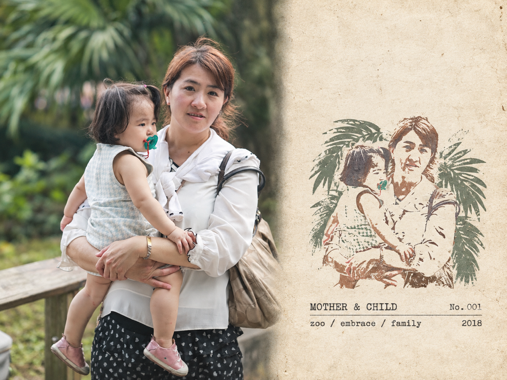
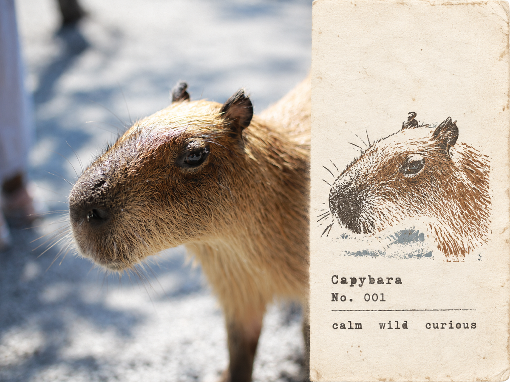

# Flickr & Google Photos Album ImageGen

A personal Codex skill that downloads an ordered range of photos from a public Flickr album or Google Photos shared album and transforms each photo independently with a user-provided image-generation prompt.

## Install

Clone this repository into your personal Codex skills directory:

```bash
git clone https://github.com/orafrank/flickr-album-imagegen.git ~/.codex/skills/flickr-album-imagegen
```

Restart Codex, then ask it to use `flickr-album-imagegen` with:

- a public Flickr album URL or Google Photos share URL;
- a page or photo range;
- an image transformation prompt.

## Examples

### Google Photos shared album

Paste a public Google Photos **share link** and describe the range and visual treatment:

> Use `flickr-album-imagegen` with https://photos.app.goo.gl/j1eSpZZYzcnWEcDS8. Process photos 1–10 in album order. Turn every photo into a separate 4:3 rubber-stamp travel-journal poster: preserve the original photo on the left 58%, and use aged off-white paper, a small hand-carved stamp illustration, and minimal 2018 journal typography on the right 42%. Never combine photos.



### Flickr album

Paste a public Flickr album URL; `/page2` and `/with/{photo-id}` URLs are supported too:

> Use `flickr-album-imagegen` with https://www.flickr.com/photos/orafrank/albums/72177720311658577/. Process photos 40–49 in album order. Turn every photo into a separate 4:3 rubber-stamp travel-journal poster: preserve the original photo on the left 58%, and use aged off-white paper, a small hand-carved stamp illustration, and minimal journal typography on the right 42%. Never combine photos.



You can replace the sample art direction with any prompt you like. The skill keeps the requested album order and processes each source image independently.

## Notes

- Each source photo is generated and saved independently.
- Album order is scoped to the exact URL, including `/page2` and later pages.
- Google Photos requires a generated `photos.app.goo.gl` or `/share/...` link; private `/album/...` links are not portable.
- Private albums and access-control bypasses are not supported.
- Image generation requires an image-generation tool available in the user's Codex environment.

---

# 中文說明

`flickr-album-imagegen` 是一個個人 Codex Skill，可依照公開 Flickr 相簿或 Google 相簿共享連結中的順序，下載指定範圍的照片，再使用你提供的提示詞逐張生成新圖片。

每張照片都會獨立處理與輸出，不會自動合成拼貼。

## 安裝

將這個儲存庫複製到個人的 Codex Skills 目錄：

```bash
git clone https://github.com/orafrank/flickr-album-imagegen.git ~/.codex/skills/flickr-album-imagegen
```

重新啟動 Codex，接著提供：

- 公開 Flickr 相簿網址或 Google 相簿共享網址；
- 要處理的頁面或照片範圍；
- 想套用的影像生成提示詞。

## 使用範例

### Google 相簿共享連結

請使用 Google 相簿的公開「共享連結」，並說明照片範圍與想要的視覺效果：

> 請使用 `flickr-album-imagegen` 處理 https://photos.app.goo.gl/j1eSpZZYzcnWEcDS8，依相簿順序處理第 1～10 張。將每張照片分別製作成獨立的 4:3 橡膠印章旅行日記海報：左側約 58% 忠實保留原始照片，右側約 42% 使用復古米白紙張、小型手刻印章插畫與簡約的 2018 年日記文字。不要將多張照片合併。


### Flickr 相簿

可直接貼上公開 Flickr 相簿網址，也支援 `/page2` 以及 `/with/{photo-id}` 格式：

> 請使用 `flickr-album-imagegen` 處理 https://www.flickr.com/photos/orafrank/albums/72177720311658577/，依相簿順序處理第 40～49 張。將每張照片分別製作成獨立的 4:3 橡膠印章旅行日記海報：左側約 58% 忠實保留原始照片，右側約 42% 使用復古米白紙張、小型手刻印章插畫與簡約日記文字。不要將多張照片合併。


範例中的美術風格可以替換成任何自訂提示詞。Skill 會維持指定的相簿順序，並逐張處理來源照片。

## 注意事項

- 每張來源照片都會獨立生成並儲存。
- 照片順序以你提供的確切網址為準，包含 `/page2` 與後續頁面。
- Google 相簿必須使用 `photos.app.goo.gl` 或 `/share/...` 形式的共享連結；私人 `/album/...` 網址無法分享給其他使用者執行。
- 不支援私人相簿，也不會繞過存取權限。
- 使用者的 Codex 環境必須具備影像生成功能。
